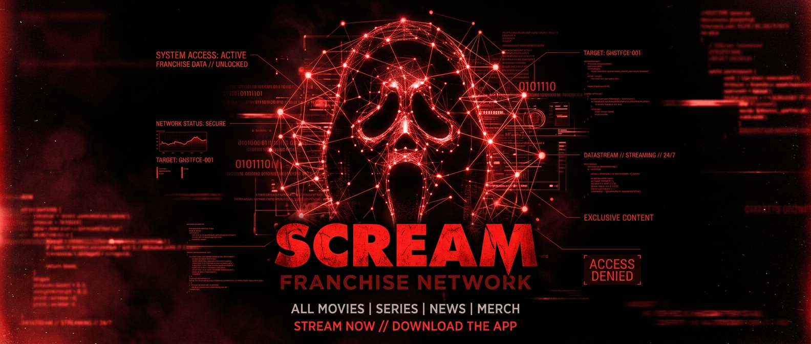

# 🔪 SCREAM SOCIAL NETWORK: Woodsboro Arhiva

## 📁 O Aplikaciji
Scream Social Network je interaktivna digitalna karta koja povezuje sve likove iz legendarne horror franšize "Scream" (Vrisak). Aplikacija vam omogućuje da istražite tko je s kim u rodu, tko je koga volio, a tko je koga... pa, ubio. Sve to kroz mračnu, "forenzičku" atmosferu Woodsboro digitalnog sustava.

Ova mreža obuhvaća sve od originalnog masakra iz 1996. pa sve do najnovijih događaja iz 2026. godine.

## 🩸 Kako koristiti aplikaciju?

1.  **Istražite Mapu**: 
    - Glavni ekran prikazuje krugove (likove) i linije (njihove veze).
    - Možete **kliknuti** na bilo koji krug da biste vidjeli detalje o tom liku u desnom izborniku.
    - Bijele linije predstavljaju ljubavne veze, plave su obiteljske, a crvene masne linije označavaju smrtonosne susrete između ubojica i žrtava.

2.  **Filtrirajte po Godinama**:
    - U desnom izborniku pod naslovom "Target Year" možete odabrati godinu filma (npr. '96, '22, '26).
    - Mapa će se automatski presložiti i prikazati samo one likove koji su se pojavili u toj godini.

3.  **Ghostface Analiza (AI Insights)**:
    - Kada odaberete nekog lika, sustav će generirati "Ghostface Analysis". To je mračan, inteligentan analitički uvid koji kopa duboko u psihološki profil i sudbinu lika. 
    - Ova značajka je pogonjena **Gemini API modelom** na serveru kako bi se osigurala jeziva i autentična evaluacija iz perspektive ubojice. Ako je mrežni sustav u offline režimu, automatski se aktivira lokalni forenzički profil.

4.  **Provjerite Status**:
    - U izborniku "DATABASE" možete vidjeti jesu li likovi živi ili mrtvi, kolika im je "razina prijetnje" i u kojim su se točno filmovima pojavili.

---

## ⚡ Novododane Napredne Funkcionalnosti

Kako bismo produbili analitičku i forenzičku stranu simulacije, u Woodsboro mrežnu arhivu ugradili smo sljedeća rješenja:

### 📊 1. Interaktivna Detekcija Zajednica (Interactive Community Detection)
Unutar desne bočne trake (Sidebar) sada se nalazi tab **"GENERATE COMMUNITIES"** (Generiraj zajednice). 
- **Fizikalna gravitacijska podjela (Gravity)**: Aktivacijom opcije **"UKLJUČI" (AKTIVAN)**, grafička simulacija u stvarnom vremenu rekonfigurira sile privlačenja unutar grafa. Gravitacijska sila prema središtima zajednica skače s neutralnog koeficijenta `0.02` na kohezivnih `0.28`.
- Likovi se fizički razdvajaju na **četiri prostorna "otoka"** (klastera) koji jasno prikazuju skupine koje najviše komuniciraju i proživljavaju zajedničku traumu ili prijetnju.
- **Fokusirani prikaz skupine (Clear Focus)**: Klikom na bilo koju karticu zajednice unutar desne bočne trake, graf zatamnjuje sve preostale čimbenike na mapi na samo `12% opaciteta` te u potpunosti ističe samo odabranu mrežu likova i njihove interne, neraskidive niti interakcije.

### 🧭 2. Pametna Forenzička Objašnjenja na Hover (Interactive Hover Tooltips)
Kako bismo olakšali instantno prepoznavanje narativnih klanova i karteristika zajednica, dodana su hover objašnjenja:
- **U Bočnoj Traci**: Kada držite kursor miša iznad značke zajednice (npr. *Woodsboro Legacy*, *The Carpenter Node*, *The Stab Parasites* ili *Secondary*) na profilu odabranog lika, pojavljuje se lebdeći mračni prozorčić s detektiranim forenzičkim dosjeom te specifične skupine.
- **Na Samom Grafu**: Postavljanjem kursora iznad bilo koje stavke u legendi u gornjem lijevom kutu mrežnog grafa, u stvarnom vremenu se generira profil klastera ("Community Profile") na samom platnu, pružajući forenzičku definiciju odabrane društvene strukture i uvid u njihov potencijal za preživljavanje.

### 🔗 3. Robusna Full-Stack Arhitektura (Express + Vite)
Kreiran je namjenski **Express poslužitelj (`server.ts`)** preko kojeg se vrši proxy komunikacija. To osigurava:
- Potpunu zaštitu Gemini API ključa na strani poslužitelja (API ključ nikada ne fluktuira prema pregledniku niti je javno izložen).
- Brzu, optimalnu detekciju te sigurnosnu "offline" Woodsboro alternaciju u slučaju izostanka privatnih varijabli mrežnog sučelja.

---

## 📖 Znanstveni Izvještaj
Za one koji žele dublje istražiti kako je cijela ova socijalna mreža strukturirana i koja je metodologija korištena, dostupan je detaljan izvještaj u datoteci [report_1.md](./report/report_1.md) koji pokriva i detaljne matematičke formule modularnosti i Louvainove detekcije zajednica.

---
*© 1996-2026 WOODSBORO FORENSICS DIVISION. SVE TAJNE VODE U WOODSBORO.*
