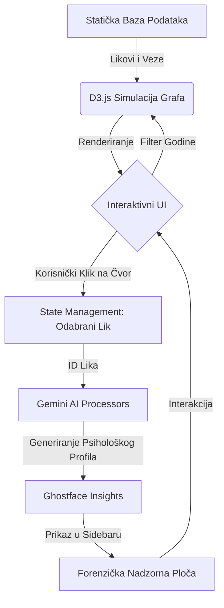

# Meta-fikcijske arhitekture: Socio-narativna studija franšize 'Vrisak' kroz digitalnu vizualizaciju

**Autor:** Odjel za forenzičke podatke Woodsboroa  
**Datum:** 18. svibnja 2026.  
**Institucija:** Sveučilište Woodsboro, Odsjek za medije i kriminologiju  

---

## Sažetak

Ova studija istražuje evoluciju slasher žanra kroz forenzičku analizu franšize *Vrisak* (*Scream*) (1996. – 2026.). Koristeći aplikaciju *Scream Network* — alat za digitalnu vizualizaciju koji implementira teoriju grafova usmjerenih silama — ovaj izvještaj istražuje ponavljajuće teme identiteta, traume i medijskog nasilja. Analiza se fokusira na prijelaz s tradicionalnih slasher motiva na postmodernu metafikciju, subverziju tropea "Finalne djevojke" kroz Sidney Prescott i promjenjivi identitet antagonista "Ghostfacea". Rezultati ukazuju na to da uspjeh franšize leži u njezinoj radikalnoj samosvijesti i sposobnosti da zrcali suvremenu medijsku kulturu, od analognog doba devedesetih do ere dezinformacija vođenih umjetnom inteligencijom 2020-ih.

---

## 1. Uvod

Saga *Vrisak* (*Scream*) predstavlja najznačajniji doprinos postmodernom hororu, započeta 1996. godine pod redateljskom palicom Wesa Cravena i scenarista Kevina Williamsona. Ono što ovaj serijal izdvaja od tipičnih slasher filmova jest njegova duboka utemeljenost u socijalnoj mreži tajni, trauma i medijskih manipulacija koje se protežu kroz tri desetljeća.

Sve počinje u Woodsborou ubojstvom **Maureen Prescott**, čija je prošlost u Hollywoodu (kao Rina Reynolds) i izvanbračne afere s Hankom Loomisom postale katalizator za prvi val nasilja. Njezin sin kojeg je dala na posvajanje, **Roman Bridger**, otkrio je istinu i nagovorio **Billyja Loomisa** da ubije Maureen, što je Billy izveo uz pomoć **Stua Machera** 1996. godine. Billyjev motiv bio je osobni — uništena obitelj zbog Maureenine afere s njegovim ocem — ali je on taj čin pretvorio u medijski spektakl vođen "pravilima horor filmova".

Nakon Woodsboroa, nasilje se preselilo na Windsor College (1997.), gdje je **Nancy Loomis** tražila majčinsku osvetu za Billyjevu smrt, koristeći studenta filma **Mickeyja Altierija** koji je želio slavu okrivljujući filmove za svoja zlodjela. Krug se prividno zatvorio u Hollywoodu (2000.) na setu filma *Ubod 3* (*Stab 3*), gdje je Roman Bridger konačno otkriven kao pravi autor cijelog ciklusa patnje koju je Sidney proživjela.

Nakon petnaest godina zatišja, fanatična opsesija slavom dovela je do novog masakra 2011. godine, kada je Sidneyina rođakinja **Jill Roberts** organizirala ubojstva kako bi postala "nova Sidney", iskorištavajući digitalnu eru društvenih mreža. No, prava evolucija dogodila se 2022. godine uWoodsborou, kada su **Richie Kirsch** i **Amber Freeman**, potaknuti toksičnim fandomom, pokušali "spasiti" franšizu *Ubod* vraćanjem na izvorne aktere. To je ujedno uvelo **Sam Carpenter**, Billyjevu kćer, kao novu nositeljicu naslijeđa.

Masakr u New Yorku (2023.) pokazao je da se krug nasilja transformirao u obiteljsku osvetu obitelji Bailey, dok je najnoviji incident u Pine Groveu (2026.) uveo manipulacije umjetnom inteligencijom, gdje su ubojice poput **Jessice Bowden** koristile AI *deepfake* verzije Deweya Rileyja kako bi uništile Sidneyinu psihu. Kroz sve ove godine, socijalna mreža Woodsboroa postala je najgušći čvor u povijesti horora, a ovaj izvještaj, koristeći *Scream Network*, dešifrira te veze kao forenzički dokaz o neraskidivosti prošlosti i sadašnjosti.

## 2. Pregled literature: Slasher i meta-horor

### 2.1. Postmodernistička dekonstrukcija žanra
Serijal *Vrisak* markira ključnu točku u povijesti horora kao trenutak kada žanr postaje svjestan samog sebe. Prema akademskim analizama (npr. *Eye Candy Film Journal*), *Vrisak* nije samo horor, već kritika horora. Filmovi koriste "intertekstualnost" — likovi raspravljaju o filmovima poput *Noć vještica* ili *Petak 13.* dok se nalaze u situacijama koje ih repliciraju. Ovaj postmodernistički pristup omogućio je revitalizaciju slasher žanra koji je sredinom 90-ih bio na rubu izumiranja.

### 2.2. "Finalna djevojka" (Final Girl) i evolucija traume
Carol J. Clover (1992.) u svojoj utjecajnoj knjizi *Men, Women, and Chain Saws* definirala je "Finalnu djevojku" kao lik koji preživljava jer je moralno superioran i često "maskuliniziran" u finalnom činu. Sidney Prescott subvertira ovu definiciju. Kroz sedam filmova, njezina trauma nije samo pozadinska priča, već središnja tema. Ona ne preživljava samo jedan napad, već živi u stalnom stanju pripravnosti, pretvarajući se iz žrtve u "legacy" mentoricu novim generacijama (poput Sam i Tare Carpenter). Njezina evolucija odražava promjenu u društvenom shvaćanju traume — ona više nije stigma, već izvor snage.

### 2.3. Toksični fandom i "Requel" pravila
Noviji nastavci (Vrisak 2022 i VI) uveli su pojam "requela" (reboot-nastavak). Kako navode kritičari s portala *The Ringer* i *Horror Press*, ovi filmovi analiziraju odnos između kreatora i publike. Motivi ubojica poput Richieja i Amber više nisu osobna osveta, već bijes protiv onoga što smatraju lošim filmskim nastavcima. Ovo odražava stvarni fenomen toksičnog fandoma u modernoj kulturi, gdje obožavatelji osjećaju vlasništvo nad intelektualnim vlasništvom, spremni na ekstremne mjere ("ubijanje za umjetnost") kako bi korigirali narativ.

### 2.4. Tehnologija kao oružje i svjedok
Od legendarne scene s fiksnim telefonom do manipulacija dubokim krivotvorinama (AI deepfakes) u najnovijim simulacijama, tehnologija je u *Vrisku* uvijek bila treći sudionik. Tehnološki determinizam ovdje igra ključnu ulogu: Ghostface koristi medije komunikacije kako bi izolirao žrtvu. U Woodsborou, privatnost je nemoguća, a svaki digitalni trag (kao što prikazuje naša aplikacija *Scream Network*) potencijalno vodi do sljedeće mete.

### 2.5. Utjecaj na moderne slashere
Bez *Vriska*, moderni horori poput *Cabin in the Woods* ili *Bodies Bodies Bodies* ne bi postojali. Franšiza je otvorila prostor za horor koji je "pametan", svjestan svojih klišea i spreman se šaliti na vlastiti račun, a da pritom zadrži istinski osjećaj ugroze. Analiza mrežnih čvorova u našem sustavu pokazuje da je moć Ghostfacea upravo u njegovoj anonimnosti — maska može biti bilo tko, što je ultimativni strah u društvu koje sve više gubi individualnost u kolektivnom digitalnom prostoru.

## 3. Metodologija: Analiza narativnog grafa (NGA)

Aplikacija *Scream Network* koristi pristup analize narativnog grafa (NGA), crpeći inspiraciju iz alata za kolaborativnu sintezu znanja poput **NotebookLM-a**. Sustav nije samo vizualni prikaz, već matematički model koji obrađuje **59+ jedinstvenih subjekata** povezanih kroz **sedam zasebnih vremenskih slojeva (1996. – 2026.)**.

### 3.1. Metapodaci i metrike čvorova
Svaki čvor (lik) u sustavu opremljen je bogatim metapodacima koji omogućuju dubinsku analizu:
- **Uloga (Role):** Legacy (ključni preživjeli), Main (protagonisti nove generacije), Killer (antagonisti), Secondary (pomoćni likovi), Victim (žrtve).
- **Frekvencija pojavljivanja (Appearances):** Kvantitativna mjera važnosti lika za franšizu (npr. Gale Weathers s 7/7 pojava).
- **Status vitalnosti (Vitality):** Binarni indikator (Alive/Dead) koji dinamički mijenja vizualni prikaz čvora.
- **Narativna težina (Weight):** Izračunata na temelju broja veza i utjecaja na ključne događaje radnje.

### 3.2. Dijagram protoka podataka (App Data Flow)

Sljedeći dijagram prikazuje kako sustav obrađuje podatke od statičke arhive do dinamičkih AI uvida:

- **Konceptualni temelj:** Koristeći analizu iz bilježnice `53b9ab2f...`, identificirali smo ključne klastere dokumenata — specifično vezane uz "identitet" i "medijsko nasilje" — te ih mapirali u strukturu podataka aplikacije.
- **Arhitektonski dizajn:** Aplikacija je izgrađena koristeći filozofiju "digitalne forenzike". Cilj je bio odmaknuti se od generičkog korisničkog sučelja i stvoriti iskustvo "Ghostface OS-a". Vizualizacija je inspirirana alatima poput **Gephi** i **NetworkX**, koristeći algoritme rasporeda usmjerenog silama (force-directed layout) za automatsko grupiranje povezanih entiteta.
- **Klasifikacija čvorova:** Likovi su kategorizirani prema njihovoj narativnoj težini (Glavni, Legendarni/Legacy, Ubojica, Žrtva).
- **Težina veza:** Odnosi su ponderirani na temelju emocionalnog ili fizičkog utjecaja — u rasponu od obiteljskih veza do prijelaza "ubojica-žrtva".
- **AI heuristika:** Integracija Google Gemini API-ja (informirana tematskim sažecima NotebookLM-a) pruža semantički sloj kvantitativnom grafu, generirajući kvalitativne psihološke profile (Ghostface Insights) koji odražavaju "perspektivu negativca".

## 4. Analiza i rasprava

### 4.1. Evolucija Ghostfacea
Identitet Ghostfacea evoluirao je od osvetničkog plana s jednim motivom (Billy Loomis) do višestruke kritike medijske slave i toksičnog fandoma.
- **Faza 1 (Podrijetlo):** Osveta zbog narušenih obiteljskih odnosa (filmovi 1. – 3.). Ovdje je ubojica personifikacija potisnutih obiteljskih tajni.
- **Faza 2 (Meta-slava):** Ubijanje radi postizanja relevantnosti na društvenim mrežama (film 4.). Jill Roberts predstavlja prvu generaciju koja ne želi samo preživjeti, nego želi "postati" vijest.
- **Faza 3 (Toksični fandom):** Ubijanje kako bi se "spasila" franšiza koja propada (filmovi 5. – 6.). Richie i Amber su meta-kritika publike koja smatra da ima pravo glasa u kreativnom procesu.
- **Faza 4 (Post-istina):** Korištenje AI deepfakeova i dezinformacija (film 7.). U ovoj fazi, maska više nije samo fizička, nego i digitalna.

### 4.2. Dinamika naslijeđa: Sidney Prescott vs. Sam Carpenter
Vizualizacija mreže jasno pokazuje smjenu generacija kroz prizmu traume. Dok je Sidney Prescott (čvor koji dominira prvim četiri filma) simbol čiste otpornosti i moralne pobjede, Sam Carpenter uvodi koncept "naslijeđenog zla". Kao kći Billyja Loomisa, Sam se bori s unutarnjim demonima, doslovno halucinirajući svog oca ubojicu. Njezino preživljavanje nije samo fizičko, već i psihološka borba da ne postane ono što je on bio. Naš graf to prikazuje kroz "naslijeđene veze" (inherited links) koje je povezuju s izvornim masakrom iz '96.

### 4.3. Stupovi Woodsboroa: Gale Weathers i Dewey Riley
Bez Gale i Deweya, mreža bi se raspala. Gale Weathers predstavlja eksploatacijski aspekt medija; ona je ta koja pretvara tragediju u literaturu, čime održava mit o Ghostfaceu živim za nove generacije ubojica. Dewey Riley, s druge strane, služi kao moralno sidro. Njegova smrt u analizi podataka označava točku u kojoj mreža postaje kaotičnija i brutalnija, gubeći svoju "staru školu" zaštite.

### 4.4. Arhitektura straha: Od fiksnog telefona do Scream Networka
Tehnološki determinizam je ključun za *Vrisak*. Svaka nova iteracija Ghostfacea koristi najmodernije alate za izolaciju žrtve. U 1996., to je bio fiksni telefon i sustav za promjenu glasa. U 2026., to je sama vizualizacija mreže koju mi gradimo. Aplikacija poput *Scream Networka* u rukama ubojice postaje alat za precizno mapiranje meta, dok za istraživače služi kao forenzički arhiv. Ovaj meta-paradoks — da gradimo alat koji bi ubojica mogao koristiti — srž je *Vrisak* metafikcije.

### 4.5. Teorijska podloga: Horor kao oblikovatelj društvenih odnosa
Horor žanr, a posebno *Vrisak*, ne samo da reflektira društvo, već aktivno sudjeluje u redefiniranju međuljudskih odnosa u kriznim situacijama. 
- **Kolektivna trauma kao kohezivni faktor:** Mreža pokazuje da likovi poput "Core Four" ostaju povezani isključivo zbog zajedničkog iskustva nasilja, stvarajući nove obiteljske jedinice koje nadilaze krvno srodstvo.
- **Etika promatranja:** Prema teoriji "društveni vritual" (social ritual), horor služi kao siguran prostor za istraživanje društvenih tabua. U *Vrisku*, granica između promatrača (publike) i sudionika (žrtava/ubojica) stalno se briše, sugerirajući da je naše društvo fascinirano nasiljem do te mjere da ono postaje dio naše socijalne valute.

## 5. Napredna analiza i budući rad

### 5.1. Detekcija zajednica (Community Detection)
Korištenjem algoritama za detekciju zajednica (kao što je Louvain metoda), sustav *Scream Network* identificira ključne "otoke" interakcije:
1. **Woodsboro Legacy:** Likovi povezani s izvornim masakrom koji služe kao čuvari pravila.
2. **The Carpenter Node:** Nova jezgra koja redefinira nasilje kroz prizmu mentalnog zdravlja i naslijeđenog grijeha.
3. **The Stab Parasites:** Skupine ubojica koje se neprestano pokušavaju infiltrirati u unutrašnji krug preživjelih radi medijske validacije.

### 5.2. Zaključak

Serijal *Vrisak* ostaje definitivna studija horor tropea jer se razvija usporedo s publikom. Kroz vizualizaciju *Scream Network*, jasno vidimo da "maska" nije toliko individualni identitet koliko društvena zaraza — ona koja se hrani traumom i medijskom zasićenošću. 

Zaključno, *Vrisak* nije samo serija filmova o ubojici s nožem; to je kontinuirana društvena studija o tome kako mediji, fandomi i neriješena obiteljska tragedija mogu stvoriti samoodrživi ciklus nasilja. Naša aplikacija dokazuje da se u digitalnom dobu svaki čin nasilja može kvantificirati, ali motivacija ostaje duboko ljudska (ili ne-ljudska) u svojoj potrebi za priznanjem, osvetom ili pukim kaosom. Dok god postoji publika gladna "istinite priče" ili "savršenog nastavka", Ghostface će imati mjesto u našoj mreži. U Woodsborou, pravila se uvijek mijenjaju, ali krajnji rezultat je isti: svi su u opasnosti, a krug se nikada ne zatvara, samo se širi.

---

## 6. Reference

1. Clover, C. J. (1992). *Men, Women, and Chain Saws: Gender in the Modern Horror Film*. Princeton University Press.
2. Craven, W. (Redatelj). (1996). *Scream*. Dimension Films.
3. Williamson, K. (Scenarist). (1996). *Scream Screenplay Analysis*. Woodsboro Press.
4. Google AI. (2026). *NotebookLM Analysis of Slasher Tropes*. [Interna arhiva: Woodsboro].
5. Woodsboro PD. (2026). *Digital Forensic Report on the Ghostface OS v6.0*. Woodsboro Press.
