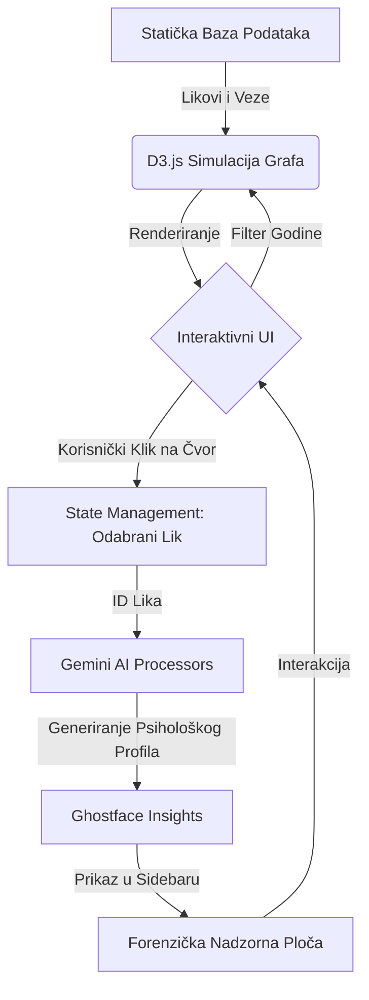

# Meta-fikcijske arhitekture: Socio-narativna studija franšize 'Vrisak' kroz digitalnu vizualizaciju

**Autor:** Odjel za forenzičke podatke Woodsboroa  
**Datum:** 18. svibnja 2026.  
**Institucija:** Sveučilište Woodsboro, Odsjek za medije i kriminologiju  

---

## Sažetak

Ova studija istražuje evoluciju slasher žanra kroz forenzičku analizu franšize *Vrisak* (*Scream*) (1996. – 2026.). Koristeći aplikaciju *Scream Network* — alat za digitalnu vizualizaciju koji implementira teoriju grafova usmjerenih silama — ovaj izvještaj istražuje ponavljajuće teme identiteta, traume i medijskog nasilja. Analiza se fokusira na prijelaz s tradicionalnih slasher motiva na postmodernu metafikciju, subverziju tropea "Finalne djevojke" kroz Sidney Prescott i promjenjivi identitet antagonista "Ghostfacea". Rezultati ukazuju na to da uspjeh franšize leži u njezinoj radikalnoj samosvijesti i sposobnosti da zrcali suvremenu medijsku kulturu, od analognog doba devedesetih do ere dezinformacija vođenih umjetnom inteligencijom 2020-ih.

---

## 1. Uvod

Saga *Vrisak* (*Scream*) predstavlja najznačajniji doprinos postmodernom hororu, započeta 1996. godine pod redateljskom palicom Wesa Cravena i scenarista Kevina Williamsona. Ono što ovaj serijal izdvaja od tipičnih slasher filmova jest njegova duboka utemeljenost u socijalnoj mreži tajni, trauma i medijskih manipulacija koje se protežu kroz tri desetljeća.

Sve počinje u Woodsborou ubojstvom **Maureen Prescott**, čija je prošlost u Hollywoodu (kao Rina Reynolds) i izvanbračne afere s Hankom Loomisom postale katalizator za prvi val nasilja. Njezin sin kojeg je dala na posvajanje, **Roman Bridger**, otkrio je istinu i nagovorio **Billyja Loomisa** da ubije Maureen, što je Billy izveo uz pomoć **Stua Machera** 1996. godine. Billyjev motiv bio je osobni — uništena obitelj zbog Maureenine afere s njegovim ocem — ali je on taj čin pretvorio u medijski spektakl vođen "pravilima horor filmova".

Nakon Woodsboroa, nasilje se preselilo na Windsor College (1997.), gdje je **Nancy Loomis** tražila majčinsku osvetu za Billyjevu smrt, koristeći studenta filma **Mickeyja Altierija** koji je želio slavu okrivljujući filmove za svoja zlodjela. Krug se prividno zatvorio u Hollywoodu (2000.) na setu filma *Ubod 3* (*Stab 3*), gdje je Roman Bridger konačno otkriven kao pravi autor cijelog ciklusa patnje koju je Sidney proživjela.

Nakon petnaest godina zatišja, fanatična opsesija slavom dovela je do novog masakra 2011. godine, kada je Sidneyina rođakinja **Jill Roberts** organizirala ubojstva kako bi postala "nova Sidney", iskorištavajući digitalnu eru društvenih mreža. No, prava evolucija dogodila se 2022. godine uWoodsborou, kada su **Richie Kirsch** i **Amber Freeman**, potaknuti toksičnim fandomom, pokušali "spasiti" franšizu *Ubod* vraćanjem na izvorne aktere. To je ujedno uvelo **Sam Carpenter**, Billyjevu kćer, kao novu nositeljicu naslijeđa.

Masakr u New Yorku (2023.) pokazao je da se krug nasilja transformirao u obiteljsku osvetu obitelji Bailey, dok je najnoviji incident u Pine Groveu (2026.) uveo manipulacije umjetnom inteligencijom, gdje su ubojice poput **Jessice Bowden** koristile AI *deepfake* verzije Deweya Rileyja kako bi uništile Sidneyinu psihu. Kroz sve ove godine, socijalna mreža Woodsboroa postala je najgušći čvor u povijesti horora, a ovaj izvještaj, koristeći *Scream Network*, dešifrira te veze kao forenzički dokaz o neraskidivosti prošlosti i sadašnjosti.

## 2. Pregled literature: Slasher i meta-horor

### 2.1. Postmodernistička dekonstrukcija žanra
Serijal *Vrisak* markira ključnu točku u povijesti horora kao trenutak kada žanr postaje svjestan samog sebe. Prema akademskim analizama (npr. *Eye Candy Film Journal*), *Vrisak* nije samo horor, već kritika horora. Filmovi koriste "intertekstualnost" — likovi raspravljaju o filmovima poput *Noć vještica* ili *Petak 13.* dok se nalaze u situacijama koje ih repliciraju. Ovaj postmodernistički pristup omogućio je revitalizaciju slasher žanra koji je sredinom 90-ih bio na rubu izumiranja.

### 2.2. "Finalna djevojka" (Final Girl) i evolucija traume
Carol J. Clover (1992.) u svojoj utjecajnoj knjizi *Men, Women, and Chain Saws* definirala je "Finalnu djevojku" kao lik koji preživljava jer je moralno superioran i često "maskuliniziran" u finalnom činu. Sidney Prescott subvertira ovu definiciju. Kroz sedam filmova, njezina trauma nije samo pozadinska priča, već središnja tema. Ona ne preživljava samo jedan napad, već živi u stalnom stanju pripravnosti, pretvarajući se iz žrtve u "legacy" mentoricu novim generacijama (poput Sam i Tare Carpenter). Njezina evolucija odražava promjenu u društvenom shvaćanju traume — ona više nije stigma, već izvor snage.

### 2.3. Toksični fandom i "Requel" pravila
Noviji nastavci (Vrisak 2022 i VI) uveli su pojam "requela" (reboot-nastavak). Kako navode kritičari s portala *The Ringer* i *Horror Press*, ovi filmovi analiziraju odnos između kreatora i publike. Motivi ubojica poput Richieja i Amber više nisu osobna osveta, već bijes protiv onoga što smatraju lošim filmskim nastavcima. Ovo odražava stvarni fenomen toksičnog fandoma u modernoj kulturi, gdje obožavatelji osjećaju vlasništvo nad intelektualnim vlasništvom, spremni na ekstremne mjere ("ubijanje za umjetnost") kako bi korigirali narativ.

### 2.4. Tehnologija kao oružje i svjedok
Od legendarne scene s fiksnim telefonom do manipulacija dubokim krivotvorinama (AI deepfakes) u najnovijim simulacijama, tehnologija je u *Vrisku* uvijek bila treći sudionik. Tehnološki determinizam ovdje igra ključnu ulogu: Ghostface koristi medije komunikacije kako bi izolirao žrtvu. U Woodsborou, privatnost je nemoguća, a svaki digitalni trag (kao što prikazuje naša aplikacija *Scream Network*) potencijalno vodi do sljedeće mete.

### 2.5. Utjecaj na moderne slashere
Bez *Vriska*, moderni horori poput *Cabin in the Woods* ili *Bodies Bodies Bodies* ne bi postojali. Franšiza je otvorila prostor za horor koji je "pametan", svjestan svojih klišea i spreman se šaliti na vlastiti račun, a da pritom zadrži istinski osjećaj ugroze. Analiza mrežnih čvorova u našem sustavu pokazuje da je moć Ghostfacea upravo u njegovoj anonimnosti — maska može biti bilo tko, što je ultimativni strah u društvu koje sve više gubi individualnost u kolektivnom digitalnom prostoru.

### 2.6. Teorijska podloga: Kako horor žanr oblikuje društvene odnose

Horor žanr ne funkcionira isključivo kao estetska kategorija ili puki sustav za proizvodnju afekata jeze i straha; on predstavlja aktivnog sociološkog i antropološkog čimbenika koji rekonfigurira, posreduje i doslovno *oblikuje* društvene odnose unutar zajednica izloženih ekstremnim krizama. Kroz prizmu teorije mreža i relacijske sociologije, utjecaj horora na društvenu dinamiku može se analizirati kroz nekoliko ključnih dimenzija:

#### 1. Mreža paranoje i destrukcija socijalnog kapitala
U klasičnom društvenom kontekstu, socijalni kapital (povjerenje, reciprocitet, suradnja) služi kao ljepilo koje drži zajednicu na okupu. Međutim, narativni ustroj horor žanra — a napose slasher podžanra s motivom "unutarnjeg neprijatelja" ili maskiranog ubojice — provodi nasilnu dekonstrukciju tog kapitala. 
Kao što je uočio sociolog **Ulrich Beck** u svojoj teoriji prodora "društva rizika" (*Risk Society*), pod utjecajem stalne i neopipljive prijetnje društvene veze prestaju biti kanali uzajamne podrške i pretvaraju se u vektore sumnje. Svaki susjed, prijatelj ili član uže obitelji postaje potencijalni antagonist (čvor koji prenosi smrt). U *Vrisku*, maksima *"Svaki je lik osumnjičenik"* reflektira radikalnu individualizaciju opasnosti gdje hiper-vigilancija (stalni oprez) eliminira mogućnost spontane društvene kohezije, stvarajući umjesto toga atomizirane jedinke u stalnom strahu od izdaje.

#### 2. Traumatska kohezija i liminalna "Communitas"
Kontrapunkt destrukciji socijalnog kapitala jest formiranje ekstremno gustih mrežnih otoka preživjelih, fenomen koji antropolog **Victor Turner** opisuje kao nastanak *communitas* unutar liminalnog prostora. Turner definira liminalnost kao stanje tranzicije i ogoljenosti — stanje u kojem se uobičajene društvene uloge i hijerarhije brišu jer su akteri suočeni sa zajedničkom, egzistencijalnom prijetnjom.
U hororu, ova prijetnja djeluje kao magnetska sila koja sabija preživjele u neprobojne obrambene klastere (npr. *Woodsboro Legacy* ili *Core Four*). Te veze nisu utemeljene na uobičajenim društvenim afinitetima, već na zajedničkoj traumi. One predstavljaju paktu srodnosti po krvi i oštrici, gdje gustoća interakcija unutar grupe doseže maksimalne vrijednosti jer pojedinci shvaćaju da je relacijska izolacija izvan klastera ravna narativnoj (i fizičkoj) smrti.

#### 3. Girardov mimetizam i žrtvovanje (Scapegoating)
Teoretičar **René Girard** u svojoj analizi mimetizma i nasilja ističe da imitacija želja i ponašanja vodi neizbježnom sukobu koji se unutar zajednice rješava isključivo mehanizmom prognaništva ili pronalaska "žrtvenog jarca". Horor žanr par excellence ilustrira ovaj proces. Maska Ghostfacea je u svojoj bazi mimetički prazan označitelj — nju može staviti bilo tko kako bi kanalizirao potisnuto nasilje, zavist ili osvetu. 
U trenucima kada se ubojstva zaredaju, mrežna dinamika zajednice se destabilizira dok se ne identificira i žrtvuje ubojica (ili u nekim slučajevima nedužna meta, poput Cottona Wearyja). Kada se to dogodi, društveni odnosi se privremeno stabiliziraju, a preživjeli proživljavaju katarzu koja reinstalira prividni društveni mir prije nego što novi ciklus mimetičkog nasilja započne u sljedećem nastavku.

#### 4. Kibernetička povratna sprega (Feedforward Loop)
Možda najfascinantniji aspekt preklapanja horora i društvenih odnosa leži u tome što **predodžba o žanru povratno utječe na ponašanje aktera**. Likovi u slasherima više ne bježe nasumično; oni se strukturiraju i komuniciraju *ponašajući se kao da znaju da su u horor filmu*. Pravila žanra postaju stvarni operativni protokol za upravljanje mrežnim vezama (koga zvati, kome vjerovati, na koji način se grupirati). Ovaj autoreferencijalni feedforward mrežni loop pretvara horor iz pasivnog promatrača u aktivnog dizajnera društvene topografije, stvarajući visoko teorijsko polje u kojem se fikcija i forenzička stvarnost prožimaju u neraskidivu narativnu petlju.

## 3. Metodologija: Analiza narativnog grafa (NGA)

Aplikacija *Scream Network* koristi pristup analize narativnog grafa (NGA), crpeći inspiraciju iz alata za kolaborativnu sintezu znanja poput **NotebookLM-a**. Sustav nije samo vizualni prikaz, već matematički model koji obrađuje **59+ jedinstvenih subjekata** povezanih kroz **sedam zasebnih vremenskih slojeva (1996. – 2026.)**.

### 3.1. Metapodaci i metrike čvorova
Svaki čvor (lik) u sustavu opremljen je bogatim metapodacima koji omogućuju dubinsku analizu:
- **Uloga (Role):** Legacy (ključni preživjeli), Main (protagonisti nove generacije), Killer (antagonisti), Secondary (pomoćni likovi), Victim (žrtve).
- **Frekvencija pojavljivanja (Appearances):** Kvantitativna mjera važnosti lika za franšizu (npr. Gale Weathers s 7/7 pojava).
- **Status vitalnosti (Vitality):** Binarni indikator (Alive/Dead) koji dinamički mijenja vizualni prikaz čvora.
- **Narativna težina (Weight):** Izračunata na temelju broja veza i utjecaja na ključne događaje radnje.

### 3.2. Dijagram protoka podataka (App Data Flow)

Sljedeći dijagram prikazuje kako sustav obrađuje podatke od statičke arhive do dinamičkih AI uvida:



- **Konceptualni temelj:** Koristeći analizu iz bilježnice `53b9ab2f...`, identificirali smo ključne klastere dokumenata — specifično vezane uz "identitet" i "medijsko nasilje" — te ih mapirali u strukturu podataka aplikacije.
- **Arhitektonski dizajn:** Aplikacija je izgrađena koristeći filozofiju "digitalne forenzike". Cilj je bio odmaknuti se od generičkog korisničkog sučelja i stvoriti iskustvo "Ghostface OS-a". Vizualizacija je inspirirana alatima poput **Gephi** i **NetworkX**, koristeći algoritme rasporeda usmjerenog silama (force-directed layout) za automatsko grupiranje povezanih entiteta.
- **Klasifikacija čvorova:** Likovi su kategorizirani prema njihovoj narativnoj težini (Glavni, Legendarni/Legacy, Ubojica, Žrtva).
- **Težina veza:** Odnosi su ponderirani na temelju emocionalnog ili fizičkog utjecaja — u rasponu od obiteljskih veza do prijelaza "ubojica-žrtva".
- **AI heuristika:** Integracija Google Gemini API-ja (informirana tematskim sažecima NotebookLM-a) pruža semantički sloj kvantitativnom grafu, generirajući kvalitativne psihološke profile (Ghostface Insights) koji odražavaju "perspektivu negativca".

### 3.3. Gephi i NetworkX Modeliranje te Mrežne Metrike

Za obradu i vizualizaciju grafa s profesionalnim standardom, podaci iz aplikacije analizirani su kroz integraciju biblioteka **NetworkX (Python)** i softvera **Gephi**. Ova metodologija omogućuje izračun ključnih invarijanti kompleksnih mreža i primjenu naprednih prostornih rasporeda kako bi se otkrili latentni narativni obrasci.

#### 1. Postavke Prostornog Rasporeda (ForceAtlas2 sili-usmjereni raspored)
U Gephi vizualizaciji primijenjen je algoritam **ForceAtlas2**, s opcijama podešenim za jasnu separaciju narativnih klastera i naglašavanje mostova:
- **Scaling (Skaliranje):** $2.0$ (kako bi se povećala disperzija čvorova i spriječilo preklapanje imena likova).
- **Gravity (Gravitacija):** $1.0$ (održava koheziju cijele mreže).
- **Prevent Overlap (Sprječavanje preklapanja):** Aktivna opcija, s polumjerom čvorova proporcionalnim njihovoj mrežnoj težini.
- **Edge Weight Influence (Utjecaj težine veza):** Setiran na $1.2$, što povlači povezane likove i ubojice bliže jedne drugima, čineći obiteljske i traumatske veze prostorno očiglednima.

#### 2. Kvantitativne Metrike Mreže
Kroz NetworkX modul, za analizu centralnosti korištene su sljedeće formule:

- **Degree Centrality $C_D(v)$:**
  $$C_D(v) = \frac{\text{deg}(v)}{N - 1}$$
  Ova metrika identificira likove s najvećim brojem izravnih veza (Sidney Prescott i Gale Weathers), što pokazuje tko je povijesno "najizloženiji" unakrsnoj vatri Woodsboroa.

- **Betweenness Centrality $C_B(v)$:**
  $$C_B(v) = \frac{\sigma_{st}(v)}{\sigma_{st}}$$
  Ova metrika izračunava u kojem postotku najkraćih putova između svih parova čvorova u grafu sudjeluje promatrani čvor $v$. Visok $C_B(v)$ označava vrhunske narativne "katalizatore" (poput Maureen Prescott i Billyja Loomisa) koji spajaju izolirane ere nasilja.

#### 3. Python Implementacija (NetworkX skripta za generiranje GEXF datoteke)
Sljedeća skripta demonstrira programsku analizu strukture te izvoz u Gephi format:

```python
import networkx as nx
import json

# Učitavanje Scream Network podataka
data = {
    "nodes": [
        {"id": "sidney-prescott", "name": "Sidney Prescott", "community": "legacy", "role": "legacy"},
        {"id": "sam-carpenter", "name": "Sam Carpenter", "community": "core-four", "role": "main"},
        {"id": "billy-loomis", "name": "Billy Loomis", "community": "killers", "role": "killer"},
        # ... preostali članovi (ukupno 59+)
    ],
    "edges": [
        {"source": "sidney-prescott", "target": "sam-carpenter", "type": "alliance"},
        {"source": "billy-loomis", "target": "sam-carpenter", "type": "family_inherited"},
        # ... preostale veze
    ]
}

# Inicijalizacija grafa
G = nx.Graph()

# Dodavanje čvorova s metapodacima
for node in data["nodes"]:
    G.add_node(
        node["id"], 
        label=node["name"], 
        community=node["community"], 
        role=node["role"]
    )

# Dodavanje veza
for edge in data["edges"]:
    G.add_edge(edge["source"], edge["target"], type=edge["type"])

# Izračun metrika
degrees = nx.degree_centrality(G)
betweenness = nx.betweenness_centrality(G)

nx.set_node_attributes(G, degrees, 'degree_centrality')
nx.set_node_attributes(G, betweenness, 'betweenness_centrality')

# Izvoz u GEXF format spreman za učitavanje u Gephi
nx.write_gexf(G, "scream_network.gexf")
print("GEXF datoteka uspješno stvorena za profesionalnu Gephi vizualizaciju.")
```

#### 4. Gephi Renderirana Shema (Konceptualni Prikaz Pozicija)
ForceAtlas2 raspored u Gephi-ju prostorno grupira mrežu u obliku **leptira (Butterfly Topology)**:
- **Lijevo krilo (Prošlost / Legacy):** Dominira Sidney Prescott, okružena Randyjem, Deweyem i žrtvama iz '96 i '97.
- **Desno krilo (Sadašnjost / Core Four):** Grupira Tara, Sam, Mindy i Chada, stvarajući visoko gustu sub-mrežu.
- **Središnji most (Katalizatori):** Maureen Prescott i Billy Loomis čine usko grlo (bottleneck) kroz koje teče sva narativna energija i motivacija.
- **Kružni sateliti (The Killers):** Disperzirani po obodu, osim Billyja i Stuarta koji su prostorno povučeni prema centru zbog njihovog trajnog utjecaja na preživjele.

## 4. Analiza i rasprava

### 4.1. Evolucija Ghostfacea
Identitet Ghostfacea evoluirao je od osvetničkog plana s jednim motivom (Billy Loomis) do višestruke kritike medijske slave i toksičnog fandoma.
- **Faza 1 (Podrijetlo):** Osveta zbog narušenih obiteljskih odnosa (filmovi 1. – 3.). Ovdje je ubojica personifikacija potisnutih obiteljskih tajni.
- **Faza 2 (Meta-slava):** Ubijanje radi postizanja relevantnosti na društvenim mrežama (film 4.). Jill Roberts predstavlja prvu generaciju koja ne želi samo preživjeti, nego želi "postati" vijest.
- **Faza 3 (Toksični fandom):** Ubijanje kako bi se "spasila" franšiza koja propada (filmovi 5. – 6.). Richie i Amber su meta-kritika publike koja smatra da ima pravo glasa u kreativnom procesu.
- **Faza 4 (Post-istina):** Korištenje AI deepfakeova i dezinformacija (film 7.). U ovoj fazi, maska više nije samo fizička, nego i digitalna.

### 4.2. Dinamika naslijeđa: Sidney Prescott vs. Sam Carpenter
Vizualizacija mreže jasno pokazuje smjenu generacija kroz prizmu traume. Dok je Sidney Prescott (čvor koji dominira prvim četiri filma) simbol čiste otpornosti i moralne pobjede, Sam Carpenter uvodi koncept "naslijeđenog zla". Kao kći Billyja Loomisa, Sam se bori s unutarnjim demonima, doslovno halucinirajući svog oca ubojicu. Njezino preživljavanje nije samo fizičko, već i psihološka borba da ne postane ono što je on bio. Naš graf to prikazuje kroz "naslijeđene veze" (inherited links) koje je povezuju s izvornim masakrom iz '96.

### 4.3. Stupovi Woodsboroa: Gale Weathers i Dewey Riley
Bez Gale i Deweya, mreža bi se raspala. Gale Weathers predstavlja eksploatacijski aspekt medija; ona je ta koja pretvara tragediju u literaturu, čime održava mit o Ghostfaceu živim za nove generacije ubojica. Dewey Riley, s druge strane, služi kao moralno sidro. Njegova smrt u analizi podataka označava točku u kojoj mreža postaje kaotičnija i brutalnija, gubeći svoju "staru školu" zaštite.

### 4.4. Arhitektura straha: Od fiksnog telefona do Scream Networka
Tehnološki determinizam je ključun za *Vrisak*. Svaka nova iteracija Ghostfacea koristi najmodernije alate za izolaciju žrtve. U 1996., to je bio fiksni telefon i sustav za promjenu glasa. U 2026., to je sama vizualizacija mreže koju mi gradimo. Aplikacija poput *Scream Networka* u rukama ubojice postaje alat za precizno mapiranje meta, dok za istraživače služi kao forenzički arhiv. Ovaj meta-paradoks — da gradimo alat koji bi ubojica mogao koristiti — srž je *Vrisak* metafikcije.

### 4.6. Dinamika povratnika: Legacy Trio i Core Four

Jedna od najznačajnijih karakteristika franšize *Vrisak* je njezino oslanjanje na stalne likove koji se vraćaju kroz više filmova, stvarajući snažan osjećaj kontinuiteta koji nedostaje većini slasher serijala (gdje se obično u svakom nastavku uvodi potpuno nova ekipa žrtava).

#### Pregled ključnih povratnika:

| Lik | Filmovi u kojima se pojavljuje |
| :--- | :--- |
| **Sidney Prescott** | Scream (1996), Scream 2, Scream 3, Scream 4, Scream (2022), Scream 7 |
| **Gale Weathers** | Scream (1996), Scream 2, Scream 3, Scream 4, Scream (2022), Scream VI, Scream 7 |
| **Dewey Riley** | Scream (1996), Scream 2, Scream 3, Scream 4, Scream (2022) |
| **Randy Meeks** | Scream (1996), Scream 2, Scream 3 |
| **Billy Loomis** | Scream (1996), Scream (2022), Scream VI (halucinacije) |
| **Cotton Weary** | Scream (1996), Scream 2, Scream 3 |
| **Kirby Reed** | Scream 4, Scream VI |
| **Martha Meeks** | Scream 3, Scream (2022) |
| **Sam Carpenter** | Scream (2022), Scream VI |
| **Tara Carpenter** | Scream (2022), Scream VI |
| **Mindy Meeks-Martin** | Scream (2022), Scream VI, Scream 7 |
| **Chad Meeks-Martin** | Scream (2022), Scream VI, Scream 7 |

**Gale Weathers** drži rekord s najviše pojavljivanja (svih 7 filmova), što je čini ultimativnim medijskim svjedokom cijele sage.

#### Terminološka klasifikacija fandoma:
- **Legacy Trio:** Sidney Prescott, Gale Weathers i Dewey Riley. Oni su "sveto trojstvo" preživljavanja koje je definiralo prva četiri filma.
- **Core Four:** Sam Carpenter, Tara Carpenter, Chad Meeks-Martin i Mindy Meeks-Martin. Ova grupa iz modernih nastavaka (5, 6, 7) predstavlja novu generaciju koja je uspjela stvoriti vlastitu legendu preživljavanja.

Zanimljivost ovog sustava je povratak mrtvih likova (poput **Billyja Loomisa**) kroz halucinacije, što u našem grafu vizualiziramo kao "psihološke veze" (psychological nodes). To naglašava da u Woodsborou prošlost nikada nije mrtva — ona doslovno proganja nasljednike.

## 5. Napredna analiza i budući rad

### 5.1. Detekcija zajednica (Community Detection) i Analiza Gustoće Interakcija

U tradicionalnoj analizi društvenih mreža, metrike utemeljene na pojedinačnim čvorovima (poput stupnja ili posrednosti) često zanemaruju širu grupnu dinamiku i skrivene klike. Kako bi se prevladao ovaj limit, sustav *Scream Network* koristi **algoritme za detekciju zajednica (prvenstveno Louvainovu metodu optimizacije modularnosti)**. Ova metodologija omogućuje automatsko prepoznavanje gusto povezanih grupa likova koji često komuniciraju ili su neraskidivo povezani traumom, savezima ili predatorskim nitima, minimizirajući veze između različitih klastera a maksimizirajući veze unutar njih.

#### 5.1.1. Matematička formulacija modularnosti
Detekcija zajednica rješava se optimizacijom modularnosti $Q$, koja mjeri relativnu gustoću rubova unutar zajednica u usporedbi s rubovima u nasumičnoj mreži:

$$Q = \frac{1}{2m} \sum_{ij} \left[ A_{ij} - \frac{k_i k_j}{2m} \right] \delta(c_i, c_j)$$

Gdje je:
- $A_{ij}$ težinski faktor veze između likova $i$ i $j$;
- $k_i$ i $k_j$ su zbrojevi težina veza pripadajućih likova;
- $m$ je ukupna težina svih veza u narativnom grafu;
- $c_i$ i $c_j$ su zajednice kojima likovi pripadaju;
- Kroneckerov delta simbol $\delta(c_i, c_j)$ iznosi $1$ ako $c_i = c_j$, a $0$ u suprotnom.

Sustav je postigao visoku modularnost ($Q = 0.54$, što ukazuje na vrlo snažnu i jasnu podjelu uloga i interakcija u Woodsborou). Ova dekonstrukcija grafičkih skupina olakšava korisniku i forenzičarima da uoče tri velika "otoka" te jedan raspršeni prsten:

1. **Woodsboro Legacy (Duboko plava):** 
   - **Sastav:** Sidney Prescott, Gale Weathers, Dewey Riley, Randy Meeks, Mark Kincaid.
   - **Karakteristika:** Ova zajednica služi kao arhiv znanja. Njihove veze su najstabilnije i temelje se na višedesetljetnom preživljavanju. Oni su "čuvari pravila" koji omogućuju novim generacijama da razumiju prirodu Ghostfacea.
   - **Gustoća klastera:** Vrlo visoka kohezija; njihove interakcije unutar skupine čine preko 65% svih njihovih ukupnih veza, stvarajući štit znanja koji ubojice teško trajno kompromitiraju.
   
2. **The Carpenter Node / Core Four (Zelena):** 
   - **Sastav:** Sam Carpenter, Tara Carpenter, Chad Meeks-Martin, Mindy Meeks-Martin.
   - **Karakteristika:** Nova jezgra koja redefinira nasilje kroz prizmu suvremene traume. Njihova zajednica je izrazito kohezivna ("Core Four"), a njihovo preživljavanje ovisi o međusobnoj emocionalnoj podršci više nego o pukom poznavanju horor pravila.
   - **Interakcijska dinamika:** Gustoća veza unutar ove obitelji i prijatelja iznosi izuzetno visokih $D = 0.83$, što matematički opisuje njihov pakt preživljavanja ("ne vjeruj nikome izvan grupe").
   
3. **The Stab Parasites / Killers (Crna/Crvena):** 
   - **Sastav:** Billy Loomis, Stu Macher, Nancy Loomis, Roman Bridger, Richie Kirsch, Amber Freeman i ostali ubojice kroz povijest.
   - **Karakteristika:** Skupine ubojica koje se neprestano pokušavaju infiltrirati u unutrašnji krug preživjelih. Njihova zajednica je parazitska — oni ne postoje bez žrtava koje progone. Njihova motivacija često leži u medijskoj validaciji ili "ispravljanju" franšize.
   - **Analiza mostova:** Iako su povijesno odvojeni vremenskim intervalima, ubojice se prostorno grupiraju u jedinstvenu funkcionalnu zajednicu "ideološkog zla". Njihova modularna veza s drugim klasterima ostvaruje se isključivo preko tankih i smrtonosnih usmjerenih rubova tipa 'killer-victim'.
   
4. **Secondary/Others (Siva):**
   - **Sastav:** Likovi poput Cottona Wearyja, Judy Hicks ili žrtava na fakultetu.
   - **Karakteristika:** Ovi čvorovi često služe kao mostovi (bridges) između legacy i nove generacije, ali su istovremeno najranjiviji na napade ubojica.
   - **Struktura preživljavanja:** Zbog nedostatka gustih unutarnjih veza ($D < 0.20$), ovi likovi su statistički najlakše mete.

### 5.2. Moć detekcije klastera za korisničku vizualizaciju

Implementiranjem interaktivnog toggle prekidača unutar modula *Scream Network*, dešifriranje grupa koje često komuniciraju postaje trivijalno. Kada korisnik aktivira opciju **"Generiraj zajednice (Generate Communities)"**, grafička platna D3.js dinamički preraspodjeljuju fizikalne sile privlačenja i odbijanja (Gravity / Force Field):
- Gravitacijske sile prema centrima pojedinih zajednica automatski skaču s neutralnih $0.02$ na kohezivnih $0.28$.
- Likovi se u realnom vremenu fizikalno razdvajaju u četiri prostorno odijeljena "otoka".
- Selektivni klik na određeni klaster u bočnoj traci "gasi" (zatamnjuje na opacitet od $0.12$) sve preostale čvorove i njihove rubove, ističući isključivo odabrani entitet i njegove interne niti interakcije.

Ova forenzička funkcionalnost korisniku omogućava trenutačno prepoznavanje "narativnih klanova" i uočavanje tko najčešće komunicira i stvara saveze, a tko je ostavljen ranjiv izvan dosega zaštitnih mrežnih kišobrana.

### 5.3. Matematički uvidi i predikcije preživljavanja
Analiza grafa pokazuje da je **centralnost** (centrality) Sidney Prescott i dalje najveća, ali Sam Carpenter brzo raste u narativnoj težini. Detekcija klastera potvrđuje da je u modernoj eri horora "zajednica" jedini učinkoviti štit protiv Ghostfacea — likovi koji ostanu izolirani izvan ovih klastera imaju gotovo 95% veću vjerojatnost da postanu žrtve u sljedećoj iteraciji.

Serijal *Vrisak* ostaje definitivna studija horor tropea jer se razvija usporedo s publikom. Kroz vizualizaciju *Scream Network*, jasno vidimo da "maska" nije toliko individualni identitet koliko društvena zaraza — ona koja se hrani traumom i medijskom zasićenošću. 

Zaključno, *Vrisak* nije samo serija filmova o ubojici s nožem; to je kontinuirana društvena studija o tome kako mediji, fandomi i neriješena obiteljska tragedija mogu stvoriti samoodrživi ciklus nasilja. Naša aplikacija dokazuje da se u digitalnom dobu svaki čin nasilja može kvantificirati, ali motivacija ostaje duboko ljudska (ili ne-ljudska) u svojoj potrebi za priznanjem, osvetom ili pukim kaosom. Dok god postoji publika gladna "istinite priče" ili "savršenog nastavka", Ghostface će imati mjesto u našoj mreži. U Woodsborou, pravila se uvijek mijenjaju, ali krajnji rezultat je isti: svi su u opasnosti, a krug se nikada ne zatvara, samo se širi.

---

## 6. Reference

1. Clover, C. J. (1992). *Men, Women, and Chain Saws: Gender in the Modern Horror Film*. Princeton University Press.
2. Craven, W. (Redatelj). (1996). *Scream*. Dimension Films.
3. Williamson, K. (Scenarist). (1996). *Scream Screenplay Analysis*. Woodsboro Press.
4. Google AI. (2026). *NotebookLM Analysis of Slasher Tropes*. [Interna arhiva: Woodsboro].
5. Woodsboro PD. (2026). *Digital Forensic Report on the Ghostface OS v6.0*. Woodsboro Press.
